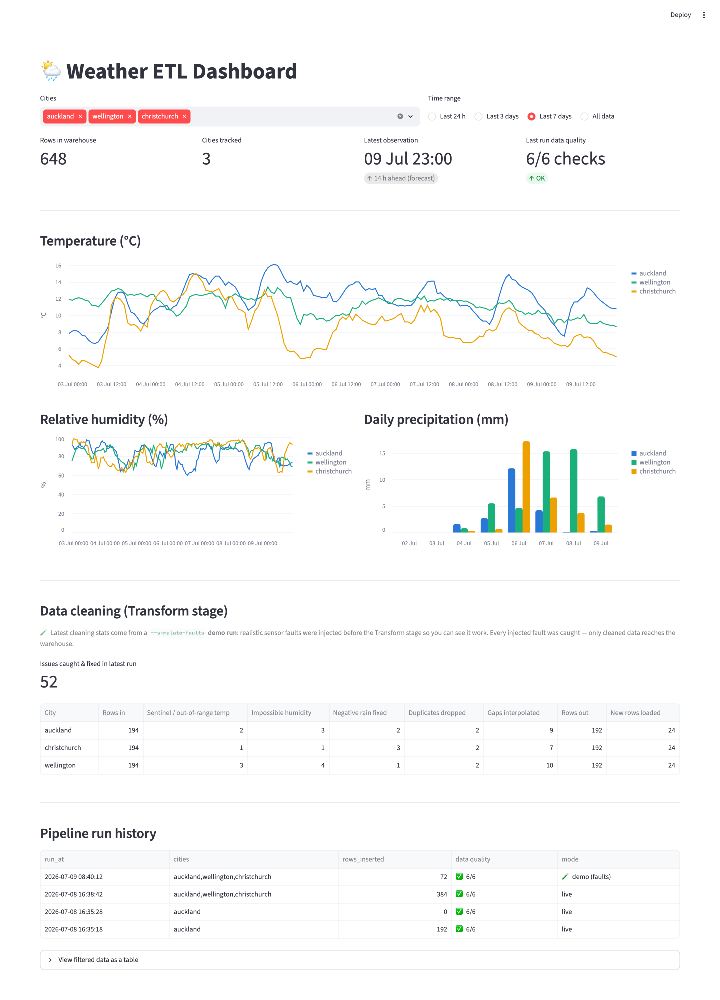

# 🌦️ Weather ETL Pipeline

**[▶ Live dashboard](https://weather-etl-pipeline-9t8ig8d9ewklztv2ompets.streamlit.app)** · built with
Python, DuckDB and Streamlit

A small but complete **data-engineering pipeline**: it ingests weather data
from a public API, cleans it, loads it incrementally into a warehouse, and runs
automated data-quality checks — on a daily schedule.

[](https://weather-etl-pipeline-9t8ig8d9ewklztv2ompets.streamlit.app)

Built to show the fundamentals of data engineering: **reliable, reproducible,
monitored data**, not one-off analysis.

## What it does (the ETL stages)

```
Extract  →  Transform  →  Load  →  Data Quality  →  (Schedule)
```

1. **Extract** (`etl/extract.py`) — pull hourly weather for NZ cities from the
   free [Open-Meteo](https://open-meteo.com) API (no key needed), with retries
   so a flaky network doesn't kill the run.
2. **Transform** (`etl/transform.py`) — turn messy column-oriented JSON into a
   tidy table and fix real-world problems:
   - sentinel/out-of-range values (e.g. `-999` temperature) → removed
   - impossible humidity (`>100`), negative rainfall → corrected
   - small gaps → interpolated
   - duplicate timestamps → de-duplicated
   - timezone-aware, sorted
   - returns a **report** of exactly what was fixed
3. **Load** (`etl/load.py`) — write into a **DuckDB** warehouse. The load is
   **idempotent / incremental**: re-running only appends new `(city, ts)` rows,
   so daily runs never duplicate data (`ON CONFLICT DO NOTHING`).
4. **Data Quality** (`etl/quality.py`) — automated checks after each load:
   row count, null rate, value ranges, duplicate keys, and **freshness**. A
   failing check makes the run exit non-zero so a scheduler can alert.
5. **Schedule** (`schedule_daily.py`) — run once a day (demo). In production
   you'd use Airflow/Dagster/cron (cron line below).

Every run is logged to a `runs` table in the warehouse (audit trail).

## Run it

```bash
pip install -r requirements.txt

python run.py                                   # Auckland, last 7 days
python run.py --cities auckland wellington christchurch
python run.py --simulate-faults                 # see the cleaning stage work (below)
```

> **Why `--simulate-faults`?** A real weather API returns *clean* data, so the
> cleaning counters read all zeros — which hides the whole point. This flag
> injects a few realistic sensor faults (sentinels, impossible humidity,
> negative rain, duplicate rows) *before* the Transform stage, so you can see
> the pipeline catch and fix them. It's standard "chaos testing", off by
> default so normal runs stay honest.

Example output:

```
=== RUN SUMMARY ===
Cities        : auckland
Rows inserted : 168
Data quality  : 6/6 passed
  ✅ row_count > 0                    168 rows
  ✅ temperature null rate < 5%       0.0%
  ✅ all values in valid range        0 out-of-range rows
  ✅ no duplicate keys                0 duplicate keys
  ✅ data fresh (< 48h)               1h old
Status        : OK
```

Run it again and `Rows inserted` drops to ~24 (only the new hours) —
demonstrating the incremental load.

### Dashboard

A read-only **Streamlit dashboard** over the warehouse — temperature/humidity
trends and daily rainfall per city, KPI tiles (row count, freshness, last-run
data quality), a **data-cleaning panel**, and the `runs` audit trail:

```bash
streamlit run dashboard.py
```

The cleaning panel reads the `transform_reports` table — every run persists a
per-city report of exactly what the Transform stage fixed (sentinels,
impossible humidity, negative rain, duplicates, interpolated gaps). Real API
data is usually clean, so pair it with `--simulate-faults` to watch the
pipeline catch injected faults; demo runs are clearly flagged 🧪 in the run
history.

Each city keeps a fixed color across all charts and filters; every chart has
hover tooltips and the filtered data is also available as a table.

### Daily schedule

```bash
python schedule_daily.py          # simple built-in loop
# or cron, 6am daily:
# 0 6 * * *  cd /path/to/repo && python run.py --cities auckland wellington
```

## Tests

The tricky logic (cleaning + incremental load + quality) is covered by
**offline unit tests** that feed a deliberately messy payload — no network
needed:

```bash
python -m pytest -q          # or: python tests/test_pipeline.py
```

They assert that outliers, impossible values, negative rain and duplicates are
all handled, and that a second load inserts **zero** rows (idempotency).

## Design notes

- **Idempotent by design** — safe to re-run; the warehouse is the source of truth.
- **Fails loud** — bad data trips a quality check and a non-zero exit code.
- **Observable** — per-run summary + `runs` audit table + structured logs.
- **Swap the source** — point `extract.py` at any API; the rest is unchanged.

## Tech

Python · requests · pandas · DuckDB (warehouse) · pytest · Open-Meteo API
